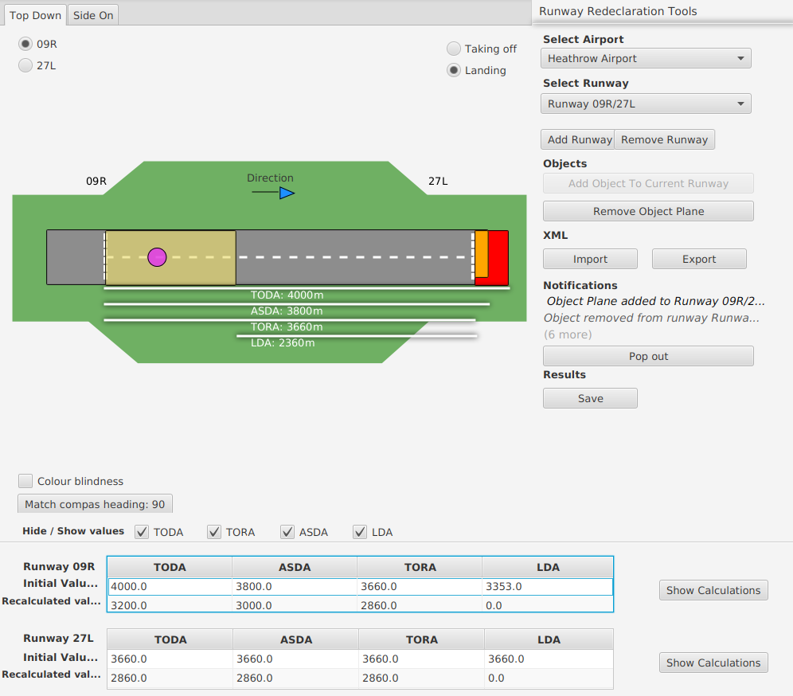

# Airport Runway

The project simulates an airport runway for landing and taking off\
It includes and extra feature of adding an obstacle on the runway

## Build

`./gradlew build` will build the project

`./gradlew jar` will produce a fatjar containing javafx dependencies, including native libraries for linux/mac/windows
The result of this can be found in build/libs/RunwayRedeclarationTeam19.jar

## Running

Java runtime 55.0 (java 11) or higher is required to run the software

The project can be run with `./gradlew run`

The fatjar can be run with `java -jar build/libs/RunwayRedeclarationTeam19.jar`

## Tests

The test suite can be run with `./gradlew test`

## Abbreviations
TODA - total distance + Clearway area (without trees)\
ASDA - total distance + Stopway area\
TORA - total distance\
LDA - landing distance
